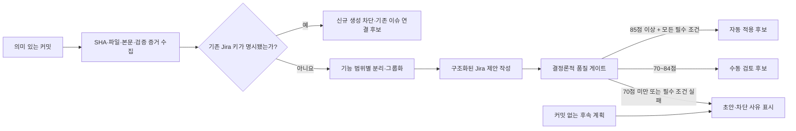

# Jira 제안 품질 개선 계획서

> 작성일: 2026-08-11  
> 대상: AutoReport의 커밋·계획 기반 Jira Task 제안 파이프라인  
> 문서 상태: 구현 기준선 확정 및 1차 구현 완료  
> 실행 상태: **단계 A 검증 완료, 단계 B 섀도 운영 유지 — Jira 외부 쓰기 없음**

## 1. 목적

소프트웨어를 개발하고 커밋하면 AutoReport가 변경 의도, 확인된 검증 결과 또는 명시적인 향후 검증 계획을 근거로 실행 가능한 Jira Task와 후속 계획을 제안하도록 품질을 높인다.

이번 개선의 핵심은 다음 세 가지다.

1. 서로 다른 작업을 한 카드에 섞지 않는다.
2. 커밋·변경 파일·테스트 결과로 확인할 수 없는 내용을 사실처럼 제안하지 않는다.
3. 담당자가 그대로 실행하고 완료 여부를 판단할 수 있는 완료조건과 검증 방법을 제공한다.

현재 콘텐츠 품질 기준선은 기존 감사 기준 **4.5/10**이며, 목표는 **8.0/10 이상**이다. 기술적 중복 방지와 승인 안전장치는 유지하면서, 의미 품질이 검증된 제안만 자동 적용 후보가 되게 한다.

구현 단계에서는 6장의 100점 점수표로 현재 표본을 다시 평가한다. 이후 공식 10점 품질은 `100점 기준 코호트 평균 ÷ 10`으로 산출한다. 따라서 완료 목표 8.0/10은 같은 표본의 평균 80/100 이상을 뜻하며, 개별 자동 적용 후보는 이보다 엄격한 85/100 기준을 사용한다.

## 2. 적용 범위와 제외 범위

### 적용 범위

- 커밋에서 Jira 신규 Task 후보를 만드는 과정
- 여러 커밋을 하나의 작업으로 묶거나 나누는 기준
- 문제, 작업 범위, 완료조건, 검증, 잔여 작업, 리스크, 일정, Epic 제안
- 제안별 품질 점수와 승인 차단 사유
- 검토 전용, 수동 승인, 자동 적용 단계의 승격 기준
- 회귀 테스트, 골든 데이터셋, 섀도 운영과 품질 측정

### 제외 범위

- 기존 Jira 이슈의 자동 완료 또는 상태 전환
- Jira 프로젝트, Sprint, Epic 구조의 전면 개편
- 사용자가 검토하지 않은 계획 전용 항목의 Jira 자동 생성·적용
- LLM 판단만으로 승인하거나 검증 근거를 만들어 내는 기능
- 이 계획서 작성 단계에서의 코드·설정·Jira 변경

## 3. 현재 품질 기준선

2026-08-11 생성된 Release_claude 6건과 CyberSecurity 6건, 총 12건을 기준선으로 사용한다.

| 평가 항목 | 현재 상태 | 판정 |
|---|---:|---|
| 전체 콘텐츠 품질 | 4.5/10 | 개선 필요 |
| 고유 ID·중복 마커·제안 리비전 | 12/12 | 양호 |
| 커밋 근거가 있는 제안 | 2/12, 16.7% | 부족 |
| 계획만 있고 커밋 근거가 없는 제안 | 10/12, 83.3% | 자동 적용 부적합 |
| 커밋 기반 제안의 검증 텍스트 | 81줄 중 휴리스틱상 명령·결과 신호 약 21줄, 25.9% | 잡음 과다 |
| 측정 가능한 완료조건 | 사실상 0/12 | 부적합 |
| 작업별 고유 리스크 | 일부만 충족 | 부족 |
| 일정·Epic 적합성 근거 | 0/12 | 부족 |
| 기술적 승인 안전성 | 8/10 | 유지 대상 |

대표 문제는 다음과 같다.

- Release_claude의 한 제안이 10개 커밋과 29개 파일, 여러 기능 영역을 하나의 Task로 묶었다.
- CyberSecurity의 한 제안이 4개 커밋과 36개 파일, 샘플·분류기·검증·주석 작업을 함께 묶었다.
- 커밋 기반 2건의 검증에는 실행 결과 외에 분석 문장, 제목, 잘린 문장, 서로 다른 테스트 기준선이 섞였다.
- 계획 전용 10건은 같은 영문 완료조건을 반복하고, 실제 실행 명령과 기대 결과를 제공하지 않았다.
- 프로젝트 공통 리스크와 동일한 일정을 여러 카드에 반복해 작업별 판단 근거가 약했다.

기준선은 다음 생성 결과를 고정해 재현한다.

- `reports/projects/Release_claude/reports/jira/2026-08-11-jira-suggestions.json`
- `reports/projects/CyberSecurity/reports/jira/2026-08-11-jira-suggestions.json`
- `project_docs/commit_to_jira_workflow.md`

`21/81`은 현재 문장 기반 휴리스틱 수치이므로 최종 KPI 기준선으로 바로 사용하지 않는다. 단계 0에서 다음 규칙으로 다시 라벨링한다.

- 실행 증거는 정확한 명령, 실행 환경, 실제 결과 또는 종료 코드, 원본 출처가 연결된 하나의 항목이어야 한다.
- 앞으로 실행할 명령과 기대 결과는 `verification_plan`으로 분류하고 실행 증거의 분자에 포함하지 않는다.
- 제목, 분석 문장, 계획 문장, 잘린 로그, 출처가 다른 중복 결과는 유효 실행 증거로 세지 않는다.
- 두 검토자가 독립 라벨링한 뒤 불일치 항목을 합의해 골든 정답을 확정한다.

## 4. 목표 운영 흐름

계획 전용 항목은 버리지 않되 `plan_draft`로 분리한다. 커밋 기반 제안인 `commit_backed`와 같은 승인 목록에서 동등하게 취급하지 않는다.

## 5. 품질 KPI와 목표

### 5.1 핵심 KPI

| KPI | 계산식 | 기준선 | 목표 | 측정 주기 |
|---|---|---:|---:|---|
| 승인 준비 완료율 | 모든 필수 게이트를 통과한 커밋 기반 제안 수 / 전체 커밋 기반 제안 수 | 신규 측정 | 섀도 종료 시 80% 이상 | 실행별·주간 |
| 검증 증거 정밀도 | 명령·환경·실제 결과·출처가 연결된 유효 실행 증거 수 / 실행 증거로 추출된 전체 후보 수 | 휴리스틱 약 25.9%, 단계 0에서 재측정 | 85% 이상 | 실행별·주간 |
| 작업 단위 적합률 | 검토자가 단일 결과물로 응집됐다고 판정한 제안 수 / 검토 제안 수 | 낮음 | 95% 이상 | 주간 |

세 KPI는 실행별 또는 주간 제안 묶음인 코호트 수준에서 계산한다. 개별 카드에 정밀도 85%나 적합률 95%를 적용하지 않는다. 개별 자동 적용 여부는 7장의 필수 게이트로 판정하며, 평균 점수가 높아도 필수 게이트 하나가 실패하면 자동 적용하지 않는다.

### 5.2 선행 지표

| 지표 | 목표 |
|---|---:|
| 신규 Task 후보의 전체 커밋 SHA 보존율 | 100% |
| 커밋 기반 제안의 측정 가능한 완료조건 보유율 | 100% |
| 실행 증거와 향후 검증 계획의 분리율 | 100% |
| 실행 가능한 검증 명령·환경·판정 기준 보유율 | 자동 적용 후보 100% |
| 작업별 고유 리스크 또는 `확인된 리스크 없음` 근거 보유율 | 90% 이상 |
| 일정·Epic 선택 근거 보유율 | 검토 제안 90% 이상, 자동 적용 후보 100% |
| 품질 차단 사유 표시율 | 차단 제안 100% |
| 계획 전용 제안의 명시적 분류율 | 100% |

### 5.3 안전 가드레일

| 가드레일 | 허용치 |
|---|---:|
| 같은 제안의 Jira 중복 생성 | 0건 |
| 오래된 리비전 승인 | 0건 |
| 제안 승인으로 인한 기존 이슈 자동 완료·상태 전환 | 0건 |
| 계획 전용 제안의 자동 적용 | 0건 |
| 종료된 Sprint에 신규 제안 적용 | 0건 |
| 응답 불명 상태에서의 무조건 재시도 | 0건 |

## 6. 제안 품질 점수표

점수는 설명 가능하고 재현 가능한 100점 기준으로 계산한다.

| 영역 | 배점 | 만점 조건 |
|---|---:|---|
| 출처 추적성 | 20 | 전체 SHA, 변경 파일, 저장소·브랜치가 보존되고 기존 Jira 참조 여부가 판별됨 |
| 작업 단위 응집도 | 20 | 하나의 기능 결과물이며 서로 무관한 경로·목적이 섞이지 않음 |
| 검증 증거·계획 | 20 | 이미 실행한 증거와 향후 검증 계획이 분리되고, 명령·환경·실제 또는 기대 결과가 명확하며 추측이 없음 |
| 완료조건 | 20 | 최소 2개의 측정 가능한 조건과 기대 결과가 있음 |
| 실행 계획 적합성 | 10 | 잔여 작업, 작업별 리스크, 일정 근거가 일관됨 |
| 명료성 | 10 | 제목과 설명이 구체적이며 상투 문구·중복 문장이 없음 |

등급은 다음처럼 사용한다.

- **85~100점:** 자동 적용 후보. 단, 모든 필수 게이트도 통과해야 한다.
- **70~84점:** 수동 검토 후보. 편집 후 승인할 수 있다.
- **0~69점:** 초안. 차단 사유와 필요한 보완 근거를 표시한다.

`confidence=high`는 문장이 자연스럽다는 뜻이 아니라, **85점 이상이며 필수 게이트가 모두 통과된 상태**로만 정의한다.

## 7. 필수 품질 게이트

### 7.1 자동 적용 후보가 되기 위한 조건

다음 조건을 모두 충족해야 한다.

1. 의미 있는 커밋에 근거하며 전체 SHA와 변경 파일이 있다.
2. 기본적으로 1~3개의 응집된 커밋만 포함한다.
3. 문제 또는 목적, 변경 범위, 기대 결과가 구분돼 있다.
4. 최소 2개의 측정 가능한 완료조건이 한국어로 작성돼 있다.
5. 실행한 검증이 있으면 명령, 환경, 실제 결과, 출처가 기록돼 있다. 실행하지 않았다면 명령, 환경, 기대 결과, 판정 기준, `not_run` 상태의 향후 검증 계획이 있다.
6. 작업별 리스크와 잔여 작업이 근거와 함께 작성돼 있다.
7. 일정과 Epic 선택에 설정 또는 변경 범위 기반 근거가 있다.
8. 이미 연결된 Jira 키가 없고, 제안 리비전·중복 마커·outbox 검사가 유효하다.
9. 자동 생성 스냅샷, merge, WIP, 임시 커밋 등 제외 패턴이 아니다.
10. 상충하는 테스트 결과나 미확인 오류가 숨겨지지 않았고, 실행하지 않은 검증을 성공으로 표현하지 않는다.

### 7.2 즉시 초안으로 내리는 조건

- 출처 커밋이 0개인 계획 전용 항목
- 서로 다른 기능 영역이나 무관한 파일 경로를 하나로 묶은 항목
- 특별한 근거 없이 3개를 초과한 커밋 묶음
- `검증 근거 미기록` 또는 실제 실행 여부를 알 수 없는 검증
- 반복된 영문 상투 문구만 있는 완료조건
- 제목·본문의 자유 텍스트 예시에 우연히 나타난 Jira 키
- 일정, Epic, 리스크가 프로젝트 기본값을 복사한 것뿐인 항목
- 실패, timeout, 응답 불명 또는 리비전 충돌 상태

## 8. 개선 작업 계획

### 단계 0. 기준선 고정과 자동 적용 격리

목표는 개선 전후를 같은 자료로 비교하고 낮은 품질의 신규 Task가 생기지 않게 하는 것이다.

- 현재 12개 제안과 원본 커밋을 골든 데이터셋으로 고정한다.
- 기대 분할, 허용 근거, 금지 문구, 완료조건 예시를 사람이 라벨링한다.
- 품질 개선 기간에는 신규 생성 경로를 `shadow` 또는 `review_only`로 운영한다.
- 기존 중복 마커, 리비전, outbox, 단일 writer 보호는 그대로 유지한다.

완료 기준:

- 12개 기준 제안마다 `적합`, `분할 필요`, `근거 부족`, `계획 초안` 판정이 있다.
- 실제 Jira 쓰기 없이 동일 입력을 반복 평가할 수 있다.

### 단계 1. 제안 스키마와 품질 판정 구조화

- `evidence_type`을 `commit_backed`, `plan_draft`로 분리한다.
- `quality_score`, `quality_grade`, `blocking_reasons`, `evidence_items`를 제안에 추가한다.
- `executed_validation`과 `verification_plan`을 별도 필드로 저장한다.
- 문제, 변경 범위, 완료조건, 검증, 잔여 작업, 리스크를 독립 필드로 유지한다.
- 사람이 편집한 내용과 생성 원본의 리비전을 구분한다.
- 생성기, UI, hook, CLI, 적용 서비스가 함께 사용하는 결정론적 `proposal_quality_validator` 계약을 정의한다.

예상 변경 대상:

- `workflow/jira_planning.py`
- `scripts/generate_periodic_reports.py`
- `scripts/sync_commit_to_jira.py`

완료 기준:

- 같은 입력은 같은 점수와 차단 사유를 만든다.
- 계획 전용 항목은 자동 적용 후보가 될 수 없다.
- 어떤 진입 경로에서도 공용 validator를 우회해 Jira 쓰기를 시작할 수 없다.

### 단계 2. 커밋 분할·그룹화 개선

- 명시된 Jira 키가 있으면 신규 Task 생성을 억제하고 기존 이슈 연결 후보로 분류한다.
- 기능 경로, 컴포넌트, 커밋 목적, 명시된 이슈 키 순으로 그룹화한다.
- 파일 수가 많거나 기능 영역이 둘 이상이면 먼저 분할한다.
- 3개 초과 커밋 묶음은 명시적인 동일 작업 근거가 있을 때만 허용한다.
- 제목 키워드 유사도만으로 서로 다른 작업을 합치지 않는다.

골든 데이터 기대 결과:

- Release_claude의 10커밋·29파일 묶음은 최소 3개의 응집된 후보로 분리한다.
- CyberSecurity의 4커밋·36파일 묶음은 변경 범위에 따라 2~4개의 후보로 분리한다.

완료 기준:

- 무관한 기능 영역이 하나의 자동 적용 후보에 함께 들어가는 사례가 0건이다.
- 자동 적용 후보는 기본 1~3개 커밋 제한을 충족한다.

### 단계 3. 검증 증거·계획 정제

- 이미 수행한 검증은 `command`, `environment`, `actual_result`, `source`, `executed_at` 구조로 수집한다.
- 앞으로 수행할 검증은 `command`, `environment`, `expected_result`, `pass_criteria`, `status=not_run` 구조로 작성한다.
- 로그 제목, 분석 문장, 잘린 문장, 단순 계획, 중복 결과는 제거한다.
- 서로 다른 테스트 suite 결과를 한 결과처럼 합치지 않는다.
- 제안 본문에는 대표 증거를 최대 5개만 표시하고 전체 로그는 링크 또는 별도 원본으로 보존한다.
- 실행 기록이 없으면 결과를 추정하지 않고 실행 가능한 `verification_plan`과 `remaining_work`를 제공한다.
- 계획된 명령을 실행 증거로 승격할 때는 실제 결과와 원본 출처가 추가돼야 한다.

완료 기준:

- 검증 증거 정밀도 85% 이상이다.
- 실행 증거로 분류됐지만 명령과 실제 결과가 연결되지 않은 항목은 실행 증거에서 제외되고, 향후 계획은 기대 결과와 판정 기준이 없으면 자동 적용 후보에서 제외된다.
- 실패와 성공이 함께 있으면 성공으로 요약하지 않는다.
- 실행하지 않은 검증이 PASS로 표시되는 사례가 0건이다.

### 단계 4. 완료조건·리스크·일정 생성 개선

- 완료조건은 `행동/입력 → 기대 결과 → 검증 방법` 형식으로 작성한다.
- 모든 제안에 최소 2개의 측정 가능한 완료조건을 둔다.
- 변경된 코드와 테스트에서 직접 확인할 수 없는 완료조건은 `추가 확인 필요`로 표시한다.
- 프로젝트 공통 리스크를 복제하지 않고 변경 파일, 의존성, 미검증 영역에서 작업별 리스크를 도출한다.
- 일정은 모든 카드에 같은 날짜를 넣지 않고 규모, 미검증 작업, 선행 조건을 반영한다.
- Epic은 설정된 허용 범위 안에서만 제안하고 근거가 없으면 수동 선택을 요구한다.

완료조건 예시:

- `동일 커밋 SHA로 제안 생성을 2회 실행해 Jira 후보가 1건만 유지되는지 자동 테스트로 확인한다.`
- `검증 로그에 명령과 종료 코드가 모두 있을 때만 evidence 항목으로 채택되고, 설명 문장은 제외되는지 골든 테스트로 확인한다.`

완료 기준:

- 자동 적용 후보의 측정 가능한 완료조건 보유율이 100%다.
- 상투 문구 반복률이 5% 미만이다.
- 리스크 또는 리스크 없음의 근거가 90% 이상 존재한다.

### 단계 5. 검토 화면과 승인 정책 개선

- 카드에 출처 커밋, 품질 점수, 등급, 차단 사유, 검증 증거를 표시한다.
- `commit_backed`와 `plan_draft`를 별도 영역으로 분리한다.
- 품질 게이트를 통과하지 못한 카드의 자동 적용 버튼을 비활성화한다.
- 일괄 승인은 필수 게이트를 모두 통과한 카드에만 허용한다.
- 수동 편집 후에는 품질 점수와 리비전을 다시 계산한다.
- UI, hook, CLI가 어떤 요청을 보내더라도 `JiraApplyService`가 outbox 시작과 Jira POST 직전에 공용 validator를 다시 실행하고 실패 시 쓰기 없이 종료한다.

예상 변경 대상:

- `scripts/generate_periodic_reports.py`
- `scripts/jira_proxy.py`
- `workflow/jira_apply.py`

완료 기준:

- 사용자가 카드만 보고 자동 적용 불가 사유를 알 수 있다.
- 편집 전 제안과 편집 후 승인본이 리비전으로 추적된다.
- 낮은 품질 카드가 일괄 승인에 포함되는 경로가 없다.
- UI, hook, CLI, 직접 서비스 호출의 품질 게이트 우회 테스트가 모두 실패 폐쇄로 통과한다.

### 단계 6. 자동화 테스트와 품질 평가

- 현재 12개 제안을 골든 회귀 테스트로 만든다.
- 서로 다른 기능, 커밋 4개 이상, 검증 누락, Jira 키 예시 문자열, timeout, 동일 SHA 재실행 사례를 추가한다.
- 제안 생성부터 검토, outbox, Jira 적용 직전까지 dry-run E2E 테스트를 수행한다.
- 기존 안전성 테스트 전체를 유지한다.

예상 테스트 대상:

- `tests/test_jira_planning.py`
- `tests/test_sync_commit_to_jira.py`
- `tests/test_sprint_tasks.py`
- `tests/test_jira_apply.py`
- 신규 골든 품질 테스트 파일

완료 기준:

- 현재 전체 회귀 테스트가 모두 통과한다.
- 신규 품질 골든 테스트가 모두 통과한다.
- 같은 입력의 점수, 분할 결과, 차단 사유가 실행마다 동일하다.

## 9. 검증 계획

### 9.1 골든 데이터 평가

각 제안에 사람이 기대값을 지정하고 다음 항목을 자동 비교한다.

- 포함돼야 할 커밋과 제외돼야 할 커밋
- 예상 Task 수와 각 Task의 기능 범위
- 허용되는 검증 증거와 제거할 잡음
- 최소 완료조건과 기대 결과
- 자동 적용, 수동 검토, 초안 중 기대 등급

### 9.2 정량 평가

- 혼합 작업 오탐률: 서로 무관한 작업을 합친 비율
- 과분할률: 하나의 결과물을 불필요하게 여러 Task로 나눈 비율
- 증거 정밀도와 재현율
- 완료조건의 측정 가능 비율
- 자동 적용 후보의 사람 승인 일치율

### 9.3 섀도 운영

- 기간: 최소 5영업일
- 표본: 최소 20개의 자동 적용 가능 커밋
- 표본 구성: 활성 프로젝트마다 최소 5개를 포함하고, 기능 추가·수정·문서·테스트 변경을 가능한 범위에서 층화
- 실제 Jira 쓰기: 없음
- 매일 확인: 제안 수, 분할 결과, 차단 사유, KPI, 가드레일 위반
- 사람 검토: 자동 적용 후보 전수와 나머지 등급의 20% 이상을 검토해 예상 등급과 비교
- 종료 조건: 표본 수와 기간을 모두 충족하고 KPI 목표를 달성

표본이 20개보다 적거나 프로젝트별 최소 표본을 채우지 못하면 기간을 연장한다. 12건 기준선만으로 임계값을 확정하지 않고 섀도 결과로 한 번 보정한다.

## 10. 단계별 롤아웃

| 단계 | 운영 모드 | 승격 조건 | 실패 시 조치 |
|---|---|---|---|
| A | 기능 플래그 뒤 구현, Jira 쓰기 없음 | 골든·회귀 테스트 통과 | 기능 플래그 비활성화 |
| B | 섀도 모드 | 5영업일·20커밋·프로젝트별 5개 이상, KPI 충족, 가드레일 위반 0건 | 기준 보정 후 섀도 연장 |
| C | 수동 승인 전용 | 최소 1주·수동 승인 20건·프로젝트별 5건 이상, 잘못된 생성·중복 0건 | 섀도 모드 복귀 |
| D | 고품질 카드 canary 자동 적용 | 85점 이상, 필수 게이트 전부 통과, 단일 writer, 최초 5영업일 일 3건 이하·프로젝트별 일 2건 이하 | 자동 적용 즉시 비활성화 |

자동 적용을 비활성화해도 생성된 제안과 outbox 기록은 보존해 원인 분석과 수동 복구가 가능해야 한다.

### 10.1 감시와 kill switch

- outbox의 `failed`, `uncertain`, 장기 `in_flight`를 실행 직후와 일일 리포트에서 확인한다.
- 첫 `uncertain`이 생기면 해당 작업을 재전송하지 않고 자동 적용을 일시 정지한 뒤 Jira marker로 조정한다.
- 중복 생성, 오래된 리비전 승인, 계획 초안 적용, 기존 이슈 상태 전환이 1건이라도 발생하면 즉시 단계 B로 복귀한다.
- 24시간 안에 Jira 쓰기 `failed`가 2건 이상이거나 사람 표본 검토의 부적합률이 5%를 넘으면 자동 적용을 중지한다.
- 경보 발생 후 15분 안에 자동 적용 플래그를 끌 수 있는 운영 절차와 담당자를 단계 D 전에 지정한다.

## 11. 예상 일정

| 작업일 | 주요 결과물 |
|---|---|
| 1일차 | 기준선·골든 데이터셋·점수표·스키마 확정 |
| 2일차 | 커밋 분할·그룹화 로직과 테스트 |
| 3일차 | 검증 증거 정제, 완료조건·리스크 생성과 테스트 |
| 4일차 | 품질 게이트, 검토 화면, 승인 정책과 회귀 테스트 |
| 5일차 | dry-run E2E, 품질 리포트, 섀도 운영 준비 |
| 이후 최소 5영업일 | 20개 이상 커밋 섀도 평가와 임계값 보정 |

일정은 구현 담당자 1명이 기존 코드를 이해하고 있다는 가정의 초안이다. 실제 변경 범위와 골든 라벨 검토 시간에 따라 조정한다.

## 12. 완료 정의

다음 조건을 모두 충족해야 품질 개선이 완료된 것으로 판정한다.

1. 100점 평가표의 코호트 평균이 80점 이상이며 공식 콘텐츠 품질이 8.0/10 이상이다.
2. 커밋 기반 제안의 승인 준비 완료율이 80% 이상이다.
3. 작업 단위 적합률이 95% 이상이고 자동 적용 후보에 무관한 작업이 함께 묶인 사례가 0건이다.
4. 검증 증거 정밀도가 85% 이상이고 실행 증거와 향후 검증 계획의 분리율이 100%다.
5. 자동 적용 제안 100%에 커밋 근거, 측정 가능한 완료조건, 실행한 검증 근거 또는 `not_run`으로 표시된 실행 가능한 검증 계획이 있다.
6. 작업별 리스크 근거 보유율이 90% 이상이고, 일정·Epic 선택 근거 보유율은 검토 제안 90% 이상·자동 적용 후보 100%다.
7. 계획 전용 제안이 자동 적용된 사례가 0건이다.
8. 중복 생성, 오래된 승인, 자동 상태 전환, 응답 불명 상태의 무조건 재시도가 모두 0건이다.
9. 기존 전체 회귀 테스트, 신규 품질 테스트, UI·hook·CLI·직접 서비스 우회 방지 테스트가 모두 통과한다.
10. 사용자가 검토 화면에서 점수와 차단 사유를 확인할 수 있다.
11. 롤백 절차, kill switch SLA, outbox 감시, 단일 writer 운영 조건이 문서화돼 있다.

## 13. 주요 리스크와 대응

| 리스크 | 영향 | 대응 |
|---|---|---|
| 게이트가 너무 엄격해 제안이 거의 생성되지 않음 | 자동화 효율 저하 | 초안을 보존하고 부족한 증거를 구체적으로 안내, 섀도 결과로 임계값 보정 |
| 커밋을 지나치게 잘게 나눔 | Jira 카드 과다 | 먼저 기능 결과물로 분리한 뒤 동일 목적·경로·검증을 만족할 때만 병합 |
| LLM 출력 변동 | 점수와 승인 결과 불안정 | 분할, 증거 채택, 필수 게이트를 결정론적 규칙으로 처리 |
| 테스트 기록 부족 | 검증 내용을 생성할 유혹 | 실행 결과를 만들지 않고 `executed_validation`을 비운 채 `not_run` 검증 계획과 판정 기준을 명시 |
| 두 PC에서 동시 자동 적용 | Jira 중복 생성 가능 | 자동 적용은 단일 writer로 제한하고 중앙 조정 전에는 다중 writer 금지 |
| 품질 점수만 높고 실제 내용은 부적합 | 잘못된 Task 생성 | 점수와 별도로 필수 게이트 적용, 초기에는 사람 표본 검토 유지 |

## 14. 산출물

- Jira 제안 품질 점수표와 판정 규칙
- 현재 12건 기반 골든 데이터셋
- 커밋 분할·증거 정제·완료조건 생성 로직
- 카드별 품질 점수와 차단 사유가 보이는 검토 화면
- dry-run E2E 및 품질 회귀 테스트
- 섀도 운영 KPI 리포트
- 수동 승인·자동 적용·롤백 체크리스트

## 15. 승인 전 결정 사항

다음 값은 기준선 12건을 바탕으로 한 초안이며 섀도 운영 후 최종 확정한다.

- 자동 적용 최소 점수: 85점
- 기본 커밋 묶음 상한: 3개
- 검증 증거 정밀도 목표: 85%
- 섀도 최소 기간과 표본: 5영업일, 20커밋
- 자동 적용 운영 방식: 단일 writer

## 16. 2026-08-11 구현·검증 결과

계획의 코드 구현과 로컬 dry-run 검증은 완료했다. 커밋 분할, 구조화된 검증 증거와 향후 검증 계획, 100점 품질 판정, UI 차단 사유 표시, 서버측 재검증, outbox 기반 중복 방지, 품질 리포트 CLI를 적용했다. Jira 외부 데이터는 생성하거나 변경하지 않았다.

오늘자 Release_claude와 CyberSecurity 제안을 새 엔진으로 다시 생성한 결과는 다음과 같다.

| KPI | 결과 | 목표 판정 |
|---|---:|---|
| 전체 제안 | 18건 | 관찰값 |
| 커밋 기반 / 계획 초안 | 7건 / 11건 | 계획 초안 11건 자동 적용 차단 |
| 커밋 기반 승인 준비 완료율 | 100% | 목표 80% 충족 |
| 평균 품질 점수 | 8.41/10 | 목표 8.0 충족 |
| 작업 단위 적합 프록시 | 100% | 목표 95% 충족 |
| 가드레일 위반 | 0건 | 목표 충족 |
| 실행 증거 정밀도 | 측정 불가, 실행 증거 후보 0건 | 목표 판정 보류 |

전체 자동화 테스트는 `342 passed`이며, 로컬 리포트 생성도 성공했다. 다만 실행 증거 정밀도는 표본이 없어 아직 85% 목표를 입증하지 못했다. 따라서 `--enforce-plan-targets`는 의도대로 실패하며, 자동 적용 단계 C·D로 승격하지 않는다.

다음 운영 단계는 최소 5영업일·20커밋·프로젝트별 5개 이상의 단계 B 섀도 표본을 수집하는 것이다. 실행 명령, 환경, 실제 결과, 출처가 모두 있는 증거 표본으로 정밀도 85% 이상을 확인한 뒤에만 단계 C 수동 승인 canary를 검토한다. 그전에는 `JIRA_QUALITY_ROLLOUT_STAGE=B`를 유지한다.
